<p align="center">
  
</p>

<h1 align="center">PocketPaw</h1>

<p align="center">
  <strong>Your AI agent that lives on YOUR Computer, Mobile, works on your goals autonomously.</strong>
</p>

<p align="center">
  <a href="https://pypi.org/project/pocketpaw/"></a>
  <a href="https://opensource.org/licenses/MIT"></a>
  <a href="https://www.python.org/downloads/"></a>
  <a href="https://pypi.org/project/pocketpaw/"></a>
</p>

<p align="center">
  Self-hosted, multi-agent AI platform. Talk through <strong>Telegram</strong>, work happens on your machine.<br>
  No subscription. No cloud lock-in. Just you and your Paw.
</p>

---

## Quick Start

```bash
pip install pocketpaw && pocketpaw
```

**That's it.** One command. 30 seconds. Your own AI agent.

I'm your self-hosted, cross-platform personal AI agent. The **web dashboard** opens automatically — talk to me right in your browser, or connect me to **Discord**, **Slack**, **WhatsApp**, or **Telegram** and control me from anywhere. I run on _your_ machine, respect _your_ privacy, and I'm always here.

**No subscription. No cloud lock-in. Just you and me.**

```bash
# Isolated install
pipx install pocketpaw && pocketpaw

# Run without installing
uvx pocketpaw

# From source
git clone https://github.com/pocketpaw/pocketpaw.git
cd pocketpaw
uv run pocketpaw
```

</details>

PocketPaw will open your browser, walk you through Telegram bot setup, and be ready to go.
No Docker. No config files. No YAML. No dependency hell.

---

## What Can PocketPaw Do?

| Feature | Description |
|---------|-------------|
| 🖥️ **Web Dashboard** | Browser-based control panel — the default mode, no setup needed |
| 💬 **Multi-Channel** | Discord, Slack, WhatsApp (Personal + Business), Telegram — run any combo |
| 🤖 **Claude Agent SDK** | Default backend — official Claude SDK with built-in tools (Bash, Read, Write) |
| 🧠 **Smart Model Router** | Auto-selects Haiku / Sonnet / Opus based on task complexity |
| 🔧 **Tool Policy** | Fine-grained allow/deny control over which tools the agent can use |
| 📋 **Plan Mode** | Require approval before the agent runs shell commands or edits files |
| 🌐 **Browser Control** | Browse the web, fill forms, click buttons via accessibility tree |
| 📧 **Gmail Integration** | Search, read, and send emails via OAuth (no app passwords) |
| 📅 **Calendar Integration** | List events, create meetings, meeting prep briefings |
| 🔍 **Web Search & Research** | Tavily/Brave search + multi-step research with source synthesis |
| 🎨 **Image Generation** | Google Gemini image generation, saved locally |
| 🔊 **Voice / TTS** | Text-to-speech via OpenAI or ElevenLabs |
| 🧠 **Memory & Compaction** | Long-term facts + session history with smart compaction |
| ⏰ **Cron Scheduler** | Recurring reminders with natural language time parsing |
| 🛡️ **Security Suite** | Injection scanner, audit CLI, Guardian AI, self-audit daemon |
| 🔒 **Local-First** | Runs on YOUR machine — your data never leaves your computer |
| 🖥️ **Cross-Platform** | macOS, Windows, Linux |
| 🧩 **Skill System** | Create reusable agent skills at runtime |
| 🤝 **Task Delegation** | Delegate complex sub-tasks to Claude Code CLI |

```
You:  "Every Sunday evening, remind me which recycling bins to put out"
Paw:  *creates a recurring schedule*
Paw:  "Done. I'll check the recycling calendar and message you every Sunday at 6pm."

You:  "Organize my Downloads folder — PDFs by date, images by type, delete duplicates"
Paw:  *scans filesystem, moves 47 files, removes 12 duplicates*
Paw:  "All clean. Here's what I did: [summary]"
```

### Research & Browsing

```
You:  *drops a link in Telegram*
Paw:  *opens browser, reads the page, researches related topics*
Paw:  "Here's a summary with 3 key takeaways. Want me to save this to memory?"

**That's it!** No Docker. No config files. No YAML. No dependency hell.

I'll automatically:
1. Set up everything I need
2. Open the web dashboard in your browser
3. Be ready to help in 30 seconds!

### Coding & DevOps

## 🖥️ Web Dashboard

The browser-based dashboard is the default mode — just run `pocketpaw` and it opens at `http://localhost:8888`.

**What you get:**
- Real-time streaming chat via WebSocket
- Activity panel showing tool calls, thinking, and system events
- Settings panel for LLM, backend, and tool policy configuration
- **Channel management** — configure, start, and stop Discord/Slack/WhatsApp/Telegram from the sidebar
- Plan Mode approval modal for reviewing tool calls before execution

### Channel Management

All configured channel adapters auto-start on launch. Use the sidebar "Channels" button to:
- Configure tokens and credentials per channel
- Start/stop adapters dynamically
- See running status at a glance

Headless mode is also available for running without the dashboard:

```bash
uv run pocketpaw --discord              # Discord only
uv run pocketpaw --slack                # Slack only
uv run pocketpaw --whatsapp             # WhatsApp only
uv run pocketpaw --discord --slack      # Multiple channels
uv run pocketpaw --telegram             # Legacy Telegram mode
```

See [Channel Adapters documentation](documentation/features/channels.md) for full setup guides.

---

## 🌐 Browser Superpowers

You:  "Find that memory leak — the app crashes after 2 hours"
Paw:  *reads logs, profiles code, identifies the issue*
Paw:  "Found it. The WebSocket handler never closes connections. Here's the fix."
```

### Multi-Agent Workflows (Mission Control)

```
You:  "I need a competitor analysis report for our product launch"
Paw:  *spins up Agent A: web researcher, Agent B: data analyst, Agent C: writer*
Paw:  "3 agents working on it. Agent A is scraping competitor sites,
       Agent B is analyzing pricing data, Agent C is waiting to write the report.
       I'll ping you when it's ready."
```

I use your existing Chrome if you have it — no extra downloads. If you don't have Chrome, I'll download a small browser automatically on first use.

---

## Architecture

```mermaid
graph TD
    %% Node Definitions
    User(["👤 YOU <br/>(Telegram / Web)"])
    
    subgraph Channels ["Channel Adapters"]
        Adapters["Telegram Bot  •  WebSocket Dashboard"]
    end

    subgraph Messaging ["Internal Transport"]
        Bus["<b>Message Bus</b><br/>Async Event Queue • Inbound/Outbound Routing"]
    end

    subgraph Core ["Core Intelligence"]
        direction TB
        subgraph AgentLoop ["Agent Loop"]
            Context["<b>Context Builder</b><br/>Identity + Soul + Style + Memory"]
            Router["<b>Agent Router</b>"]
            SDKs["Claude SDK (Recommended)<br/>Open Interpreter<br/>Native"]
            Context --> Router --> SDKs
        end

        subgraph MissionControl ["Mission Control"]
            Orch["Multi-agent Orchestration<br/>Task Assignment & Lifecycle<br/>Heartbeat Daemon (15 min)"]
            Stream["Live Execution Streaming<br/>Document Management<br/>Agent Status Tracking"]
            Status["Status: INBOX ➔ ASSIGNED ➔<br/>IN_PROGRESS ➔ REVIEW ➔ DONE"]
        end
    end

    subgraph Tools ["Tool Registry"]
        Registry["Shell • Filesystem • Browser • Desktop • Memory • HTTP Fetch"]
    end

    subgraph Support ["Security & Routing"]
        LLM["<b>LLM Router</b><br/>Anthropic • OpenAI • Ollama<br/>Auto-detection + Fallback"]
        Security["<b>Security Layer (Guardian AI)</b><br/>Command Blocking • Audit Logs<br/>File Jail (Sandbox) • Panic Button"]
    end

    subgraph Memory ["Memory System"]
        FileStore["<b>File Store</b> (Default)<br/>Markdown-based<br/>Human-readable"]
        Mem0["<b>Mem0 Store</b> (Optional)<br/>Semantic Vector Search<br/>Fact Extraction"]
        API["API: remember() • recall() • search() • get_context()"]
    end

    %% Connections
    User --> Adapters
    Adapters --> Bus
    Bus --> AgentLoop
    Bus --> MissionControl
    AgentLoop --> Registry
    Registry --> LLM
    Registry --> Security
    LLM --> Memory
    Security -.-> Registry

    %% Styling
    classDef default font-family:arial,font-size:14px;
    classDef highlight fill:#f9f,stroke:#333,stroke-width:2px;
    classDef coreBox fill:#f5f7ff,stroke:#4a90e2,stroke-width:2px;
    classDef securityBox fill:#fff5f5,stroke:#e53e3e,stroke-width:1px;
    
    class AgentLoop,MissionControl coreBox;
    class Security securityBox;
```



### Claude Agent SDK (Default, Recommended)

Uses Anthropic's official Claude Agent SDK with built-in tools (Bash, Read, Write, Edit, Glob, Grep, WebSearch). Supports `PreToolUse` hooks for dangerous command blocking.

### PocketPaw Native

Custom orchestrator: Anthropic SDK for reasoning + Open Interpreter for code execution.

### Open Interpreter

Standalone Open Interpreter supporting Ollama, OpenAI, or Anthropic as the LLM provider. Good for fully local setups with Ollama.

Switch anytime in settings or config!

| Feature | Description |
|---------|-------------|
| **Multi-Agent Orchestration** | Mission Control coordinates multiple agents on complex tasks with heartbeats, live streaming, and document management |
| **3 Agent Backends** | Claude Agent SDK (recommended), Open Interpreter, or PocketPaw Native — switch anytime |
| **Multi-LLM Support** | Anthropic, OpenAI, or Ollama (100% local). Auto-detection with fallback chain |
| **Telegram-First** | Control from anywhere. QR code pairing, no port forwarding needed |
| **Web Dashboard** | Real-time WebSocket UI with chat, mission control, file browser, and system monitoring |

### Intelligence

| Feature | Description |
|---------|-------------|
| **Persistent Memory** | Dual backend — file-based markdown + Mem0 semantic vector search. Remembers across sessions |
| **Persona System** | Identity, Soul, and Style files shape personality. Injected into every conversation |
| **Skills System** | YAML-based repeatable workflows. Hot-reload, argument substitution, agent-executed |
| **Browser Automation** | Playwright-powered. Navigates, clicks, types, screenshots. Accessibility tree for semantic page understanding |
| **Scheduling** | APScheduler-based reminders and recurring tasks with natural language time parsing |

### Security

| Feature | Description |
|---------|-------------|
| **Guardian AI** | Secondary LLM analyzes every shell command before execution. Blocks dangerous patterns |
| **Audit Logging** | Append-only log of every tool use, permission check, and security event |
| **File Jail** | Agents stay within allowed directories |
| **Panic Button** | Instant kill switch from Telegram or web dashboard |
| **Single User Lock** | Only your Telegram user ID can control the agent |

---

## Memory System

### File-based Memory (Default)
Stores memories as readable markdown in `~/.pocketclaw/memory/`:
- `MEMORY.md` — Long-term facts about you
- `sessions/` — Conversation history with smart compaction

### Session Compaction

Long conversations are automatically compacted to stay within budget:
- **Recent messages** kept verbatim (configurable window)
- **Older messages** compressed to one-liner extracts (Tier 1) or LLM summaries (Tier 2, opt-in)

### USER.md Profile

PocketPaw creates identity files at `~/.pocketclaw/identity/` including `USER.md` — a profile loaded into every conversation so the agent knows your preferences.

### Optional: Mem0 (Semantic Memory)
For smarter memory with vector search and automatic fact extraction:

```bash
pip install pocketpaw[memory]
```

See [Memory documentation](documentation/features/memory.md) for details.

---

## Configuration

Config lives in `~/.pocketclaw/config.json`:

```json
{
  "agent_backend": "claude_agent_sdk",
  "anthropic_api_key": "sk-ant-...",
  "anthropic_model": "claude-sonnet-4-5-20250929",
  "tool_profile": "full",
  "memory_backend": "file",
  "smart_routing_enabled": false,
  "plan_mode": false,
  "injection_scan_enabled": true,
  "self_audit_enabled": true,
  "web_search_provider": "tavily",
  "tts_provider": "openai"
}
```

Or use environment variables (all prefixed with `POCKETCLAW_`):

```bash
# Core
export POCKETCLAW_ANTHROPIC_API_KEY="sk-ant-..."
export POCKETCLAW_AGENT_BACKEND="claude_agent_sdk"

# Channels
export POCKETCLAW_DISCORD_BOT_TOKEN="..."
export POCKETCLAW_SLACK_BOT_TOKEN="xoxb-..."
export POCKETCLAW_SLACK_APP_TOKEN="xapp-..."

# Integrations
export POCKETCLAW_GOOGLE_OAUTH_CLIENT_ID="..."
export POCKETCLAW_GOOGLE_OAUTH_CLIENT_SECRET="..."
export POCKETCLAW_TAVILY_API_KEY="..."
export POCKETCLAW_GOOGLE_API_KEY="..."
```

See the [full configuration reference](documentation/features/) for all available settings.

---

## 🔐 Security

I take your safety seriously:

- **Guardian AI** — Secondary LLM safety check before running dangerous commands
- **Injection Scanner** — Two-tier detection (regex heuristics + optional LLM deep scan) blocks prompt injection attacks
- **Tool Policy** — Restrict agent tool access with profiles (`minimal`, `coding`, `full`) and allow/deny lists
- **Plan Mode** — Require human approval before executing shell commands or file edits
- **Security Audit CLI** — Run `pocketpaw --security-audit` to check 7 security aspects (config permissions, API key exposure, audit log, etc.)
- **Self-Audit Daemon** — Daily automated health checks (12 checks) with JSON reports at `~/.pocketclaw/audit_reports/`
- **Audit Logging** — Append-only log at `~/.pocketclaw/audit.jsonl`
- **Single User Lock** — Only authorized users can control the agent
- **File Jail** — Operations restricted to allowed directories
- **Local LLM Option** — Use Ollama and never phone home

See [Security documentation](documentation/features/security.md) for details.

---

## Development

```bash
# Clone
git clone https://github.com/pocketpaw/pocketpaw.git
cd pocketpaw

# Install with dev dependencies
uv sync --dev

# Run tests
uv run pytest

# Lint
uv run ruff check .

# Format
uv run ruff format .
```

### Optional Extras

```bash
pip install pocketpaw[discord]             # Discord support
pip install pocketpaw[slack]               # Slack support
pip install pocketpaw[whatsapp-personal]   # WhatsApp Personal (QR scan)
pip install pocketpaw[image]               # Image generation (Google Gemini)
pip install pocketpaw[memory]              # Mem0 semantic memory
```

---

## 📖 Documentation

Full documentation lives in [`documentation/`](documentation/README.md):

- [Channel Adapters](documentation/features/channels.md) — Discord, Slack, WhatsApp, Telegram setup
- [Tool Policy](documentation/features/tool-policy.md) — Profiles, groups, allow/deny
- [Web Dashboard](documentation/features/web-dashboard.md) — Browser UI overview
- [Security](documentation/features/security.md) — Injection scanner, audit CLI, audit logging
- [Model Router](documentation/features/model-router.md) — Smart complexity-based model selection
- [Plan Mode](documentation/features/plan-mode.md) — Approval workflow for tool execution
- [Integrations](documentation/features/integrations.md) — OAuth, Gmail, Calendar
- [Tools](documentation/features/tools.md) — Web search, research, image gen, voice, delegation, skills
- [Memory](documentation/features/memory.md) — Session compaction, USER.md profile
- [Scheduler](documentation/features/scheduler.md) — Cron scheduler, self-audit daemon

---

## 🤝 Join the Pack

See [Feature Audit vs OpenClaw](docs/FEATURE_AUDIT_VS_OPENCLAW.md) for a detailed gap analysis.

**Next up:**
- [ ] Web search tool (Brave/Tavily)
- [ ] Self-generating skills via conversation
- [ ] Smart model routing (Opus for coding, Haiku for chat)
- [ ] Telegram group topics for parallel conversations
- [ ] OAuth framework + Gmail, Calendar, Slack integrations
- [ ] Plan mode — agent proposes before executing
- [ ] Image generation & voice/TTS

---

## Join the Pack

- Twitter: [@PocketPawAI](https://twitter.com/PocketPaw89242)
- Discord: Coming Soon
- Email: pocketpawai@gmail.com

PRs welcome. Let's build the future of personal AI together.

---

## License

MIT &copy; PocketPaw Team

<p align="center">
  
  <br>
  <strong>Made with love for humans who want AI on their own terms</strong>
</p>
